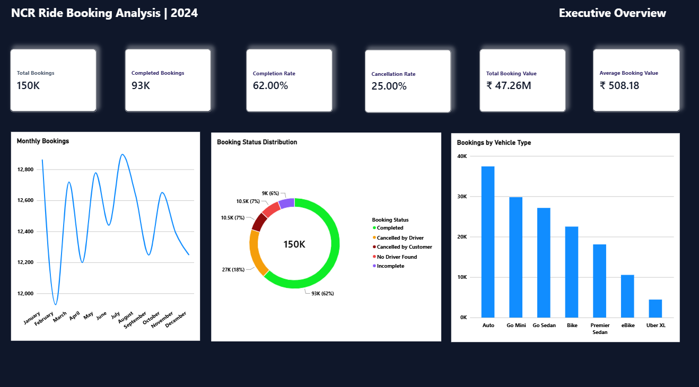
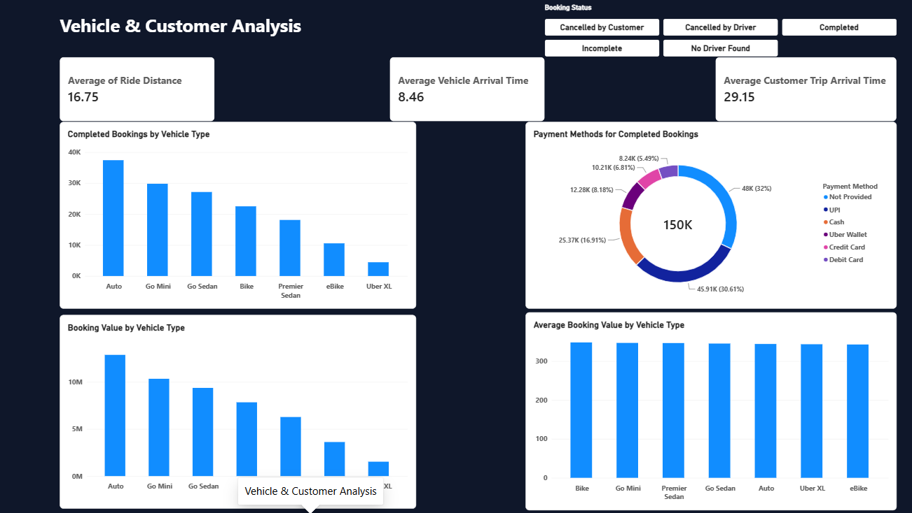
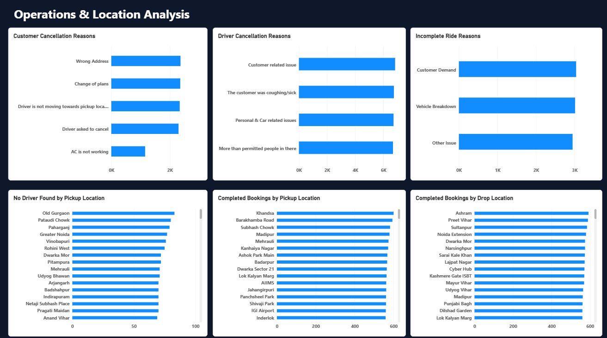
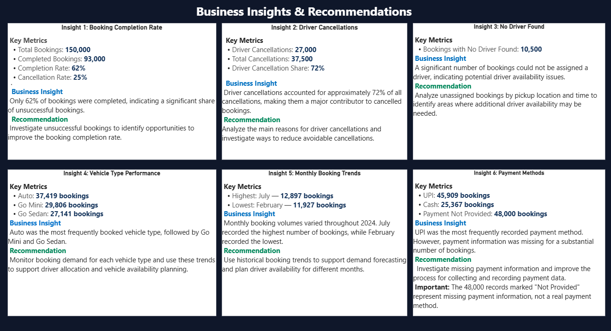

# NCR Ride Booking Analysis | 2024

## 📊 Project Overview

An end-to-end **Data Analyst project** analyzing **150,000 NCR ride booking records** to evaluate booking performance, cancellations, vehicle demand, payment methods, operational issues, and location-level trends.

The project demonstrates a complete analytics workflow using **Excel, Power Query, MySQL, and Power BI**, from data cleaning and SQL analysis to interactive dashboard development and business recommendations.

---

## 🎯 Business Objective

The main objective of this project is to understand ride-booking performance and identify operational areas that can be improved.

Key business questions include:

- What percentage of bookings are completed, cancelled, or incomplete?
- What are the major reasons for customer and driver cancellations?
- Which vehicle types have the highest booking demand?
- Which payment methods are most frequently used?
- How does booking volume change over time?
- Where are driver availability issues occurring?
- Which pickup and drop locations have the highest completed bookings?
- What recommendations can improve overall booking performance?

---

## 📁 Dataset

| Attribute | Details |
|---|---|
| Records | 150,000 |
| Period | January–December 2024 |
| Domain | Ride Booking / Transportation |
| Geography | NCR |
| Data Preparation | Excel & Power Query |

The raw data was cleaned and validated before being imported into MySQL and Power BI.

> The cleaned CSV is not included in this repository because of its large file size.

---

## 🛠️ Tools & Technologies

- **Microsoft Excel** — Data cleaning and validation
- **Power Query** — Data transformation
- **MySQL** — SQL analysis
- **Power BI** — Data visualization and dashboard development
- **DAX** — KPI calculations and measures
- **GitHub** — Project documentation and version control

---

## 🔄 Project Workflow

```text
Raw Data
   ↓
Excel Data Cleaning
   ↓
Power Query Transformation
   ↓
Data Validation
   ↓
MySQL Import
   ↓
SQL Business Analysis
   ↓
Power BI Data Modeling & DAX
   ↓
Interactive Dashboard
   ↓
Business Insights
   ↓
Recommendations


---

## 🧹 Data Cleaning & Preparation

The dataset was cleaned and validated using Excel and Power Query.

Key data-cleaning activities included:

- Checked for duplicate records
- Checked for inconsistent text values
- Handled missing values based on business context
- Replaced missing booking values with `0`
- Replaced missing ride distances with `0`
- Replaced missing driver and customer ratings with `Not Rated`
- Replaced missing payment information with `Not Provided`
- Preserved meaningful null values in cancellation and incomplete-ride fields
- Performed validation checks before importing the data into MySQL

After cleaning and validation, the final dataset contained **150,000 records**.


---

## 🗄️ SQL Analysis

The cleaned dataset was imported into MySQL for business analysis.

A total of **27 SQL queries** were developed to answer business questions related to:

- Booking performance
- Booking status
- Customer and driver cancellations
- Vehicle type demand
- Payment methods
- Booking value
- Customer and driver ratings
- Pickup and drop locations
- Monthly booking trends
- Completed booking value trends

### SQL Concepts Used

- `SELECT`
- `WHERE`
- `GROUP BY`
- `ORDER BY`
- `COUNT()`
- `SUM()`
- `AVG()`
- `CASE`
- `STR_TO_DATE()`
- Date-based analysis
- Aggregation and filtering

The SQL analysis helped identify important trends and operational issues that were later visualized in Power BI.


---

## 📈 Power BI Dashboard

The Power BI dashboard was developed to provide an interactive view of booking performance, vehicle and customer analysis, operational issues, location-level trends, and business recommendations.

The dashboard contains **4 pages**.

### 1. Executive Overview

Provides a high-level summary of overall ride-booking performance.

**Key KPIs:**

| KPI | Value |
|---|---:|
| Total Bookings | 150,000 |
| Completed Bookings | 93,000 |
| Completion Rate | 62.00% |
| Cancellation Rate | 25.00% |
| Total Booking Value | ₹47.26M |
| Average Booking Value | ₹508.18 |



---

### 2. Vehicle & Customer Analysis

Analyzes:

- Completed bookings by vehicle type
- Payment methods
- Booking value by vehicle type
- Average booking value by vehicle type
- Average ride distance
- Vehicle arrival time
- Customer trip arrival time



---

### 3. Operations & Location Analysis

Analyzes operational and location-level performance through:

- Customer cancellation reasons
- Driver cancellation reasons
- Incomplete ride reasons
- No-driver-found pickup locations
- Completed bookings by pickup location
- Completed bookings by drop location



---

### 4. Business Insights & Recommendations

Summarizes the major findings from the analysis and provides actionable business recommendations.




---

## 🔑 Key Business Insights & Recommendations

### 1. Booking Completion

Only **62% of bookings were completed**, indicating a significant share of unsuccessful bookings.

**Recommendation:**  
Investigate unsuccessful bookings to identify opportunities to improve the booking completion rate.

---

### 2. Driver Cancellations

Approximately **27,000 bookings were cancelled by drivers**, representing about **72% of total cancellations**.

**Recommendation:**  
Analyze the major driver cancellation reasons and identify ways to reduce avoidable driver cancellations.

---

### 3. No Driver Found

Approximately **10,500 bookings** were affected by a **No Driver Found** status.

**Recommendation:**  
Analyze unassigned bookings by pickup location and time to identify areas where additional driver availability may be required.

---

### 4. Vehicle Demand

**Auto** was the most frequently booked vehicle type with approximately **37,419 bookings**, followed by Go Mini and Go Sedan.

**Recommendation:**  
Monitor vehicle-level demand to support driver allocation and vehicle availability planning.

---

### 5. Monthly Booking Trends

- **Highest monthly bookings:** July — **12,897**
- **Lowest monthly bookings:** February — **11,927**

**Recommendation:**  
Use historical booking trends to support demand forecasting and driver availability planning.

---

### 6. Payment Information

UPI was one of the most frequently recorded payment methods with approximately **45,909 bookings**. However, around **48,000 bookings** had payment information recorded as **Not Provided**.

**Recommendation:**  
Investigate missing payment information to improve data completeness and reporting accuracy.


---

## 📂 Repository Contents

Ncr_ride_booking_analysis/
│
├── README.md
├── NCR_Ride_Booking_Analysis.sql
├── NCR_Ride_Booking_Analysis.pbix
├── 01_Executive_Overview.png
├── 02_Vehicle_Customer_Analysis.png
├── 03_Operations_Location_Analysis.png
└── 04_Business_Insights_Recommendations.png


## ⭐ Conclusion

This project demonstrates an end-to-end Data Analyst workflow, from **data cleaning and validation** to **SQL analysis, Power BI dashboard development, business insights, and recommendations**.

The analysis identified key operational challenges including a **62% booking completion rate**, high driver cancellations, driver availability issues, and incomplete payment information.

The project demonstrates practical skills in **Excel, Power Query, SQL, MySQL, Power BI, DAX, data visualization, and business analysis**.

---

## 👤 Author

**Shaik Abdullah**

Aspiring Data Analyst

**Skills:** SQL | MySQL | Power BI | Excel | Python | Data Analysis
